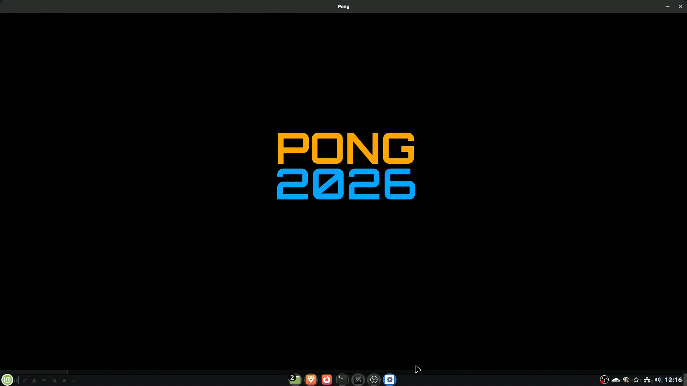
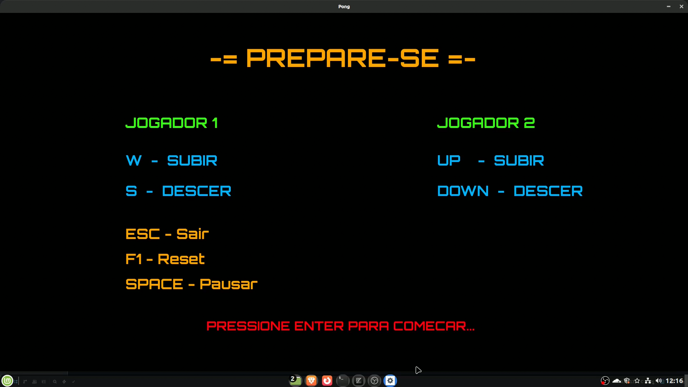
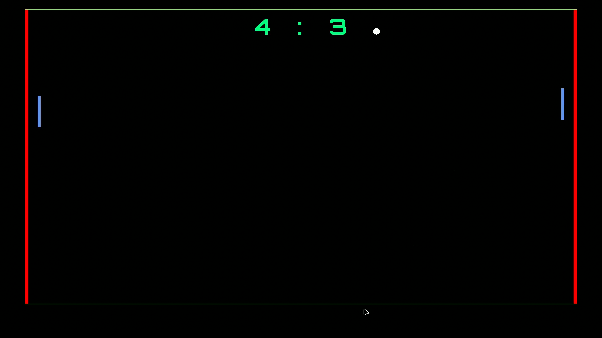

# 🏓 Pong 2026

Um remake do clássico **Pong**, desenvolvido em **C** utilizando a biblioteca **SDL2** como projeto de estudo da disciplina de Programação da graduação em Ciência da Computação.

O objetivo deste projeto é aplicar conceitos fundamentais de desenvolvimento de jogos, programação estruturada, manipulação de eventos, renderização gráfica e organização de código em C.

# Telas Principais







## Funcionalidades atuais

* Introdução animada com o título **PONG 2026**
* Tela de preparação com instruções de controle
* Sistema de placar
* Movimento das raquetes por dois jogadores
* Colisão entre bola e raquetes
* Física de colisão com influência do movimento das raquetes
* Rebote nas bordas superior e inferior
* Reinício automático da bola após cada ponto
* Renderização utilizando SDL2
* Música e efeitos sonoros sincronizados com os eventos do jogo

## Tecnologias utilizadas

* Linguagem C
* SDL2
* SDL2_ttf
* SDL2_gfx

## Estrutura do projeto
```bash
pong/
├── assets/
│   ├── fonts/
│   │   
│   ├── images/
│   │   └── pong_logo.png          # Logo utilizado na introdução
│   │
│   └── sounds/
│       ├── intro.wav              # Vinheta da introdução
│       ├── pongMusic.mp3          # Música de fundo do jogo
│      
├── audio.c              # Sistema de carregamento e reprodução dos sons
├── audio.h
│
├── intro.c              # Animação de abertura do título PONG 2026
├── intro.h
│
├── menu.c               # Tela de preparação e instruções dos jogadores
├── menu.h
│
├── main.c               # Loop principal, controles e lógica do jogo
│
└── README.md            # Documentação do projeto
```

## Compilação

Instale as dependências:

```bash
sudo apt install libsdl2-dev libsdl2-ttf-dev libsdl2-gfx-dev
```

Compile o projeto:

```bash
gcc main.c intro.c audio.c menu.c -o pong -lSDL2 -lSDL2_ttf -lSDL2_mixer -lSDL2_image -lSDL2_gfx
```

Execute:

```bash
./pong
```
## Objetivos de aprendizagem

Este projeto foi desenvolvido com foco no estudo de:

* Programação em C
* Estruturas de dados e manipulação de memória
* Programação orientada a eventos
* Desenvolvimento de jogos com SDL2
* Organização e refatoração de código
* Uso de bibliotecas externas

## Autor

**Fabiano Cunha**

Graduando em Ciência da Computação.

GitHub: https://github.com/oanbifa-del
